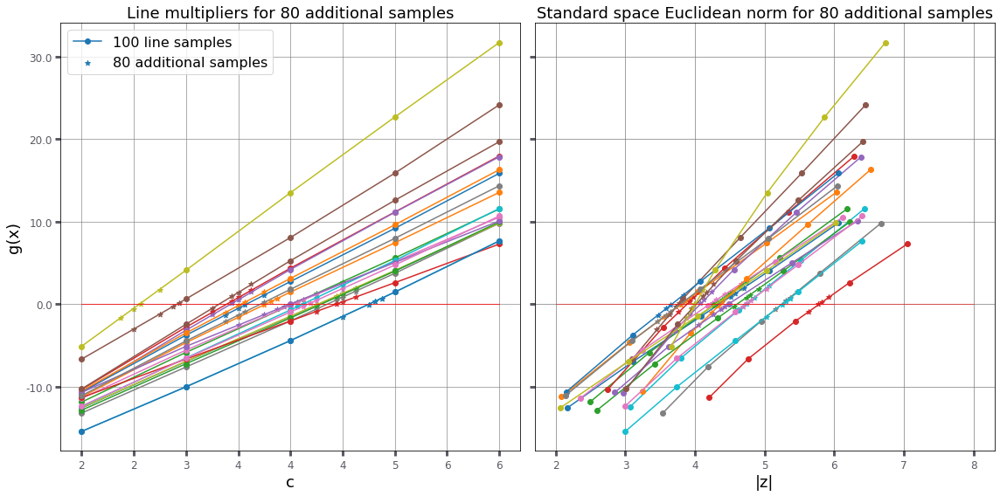
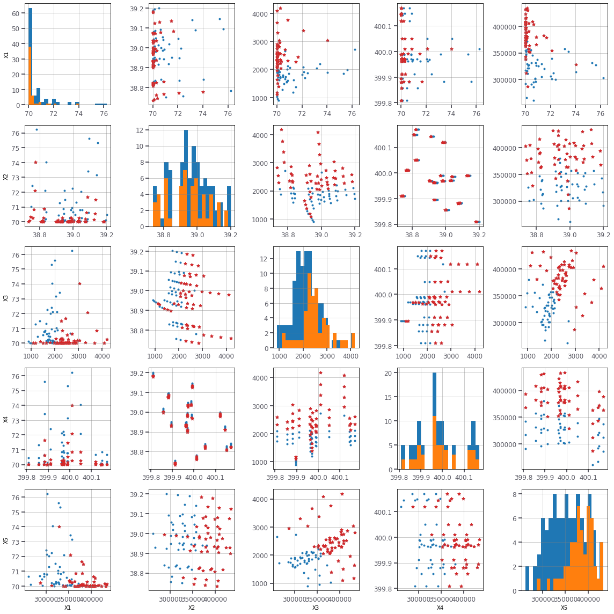
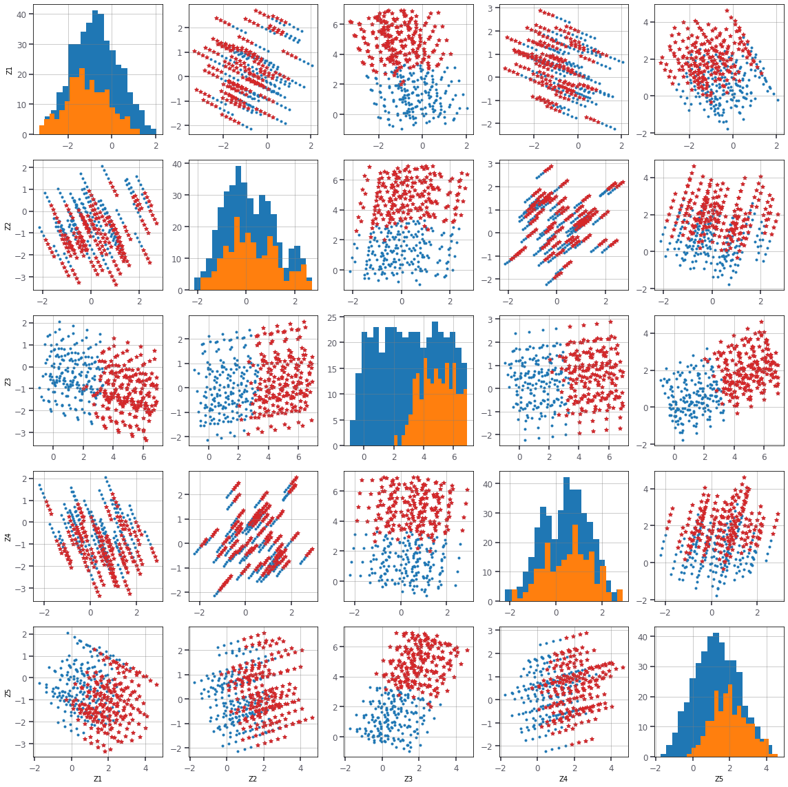
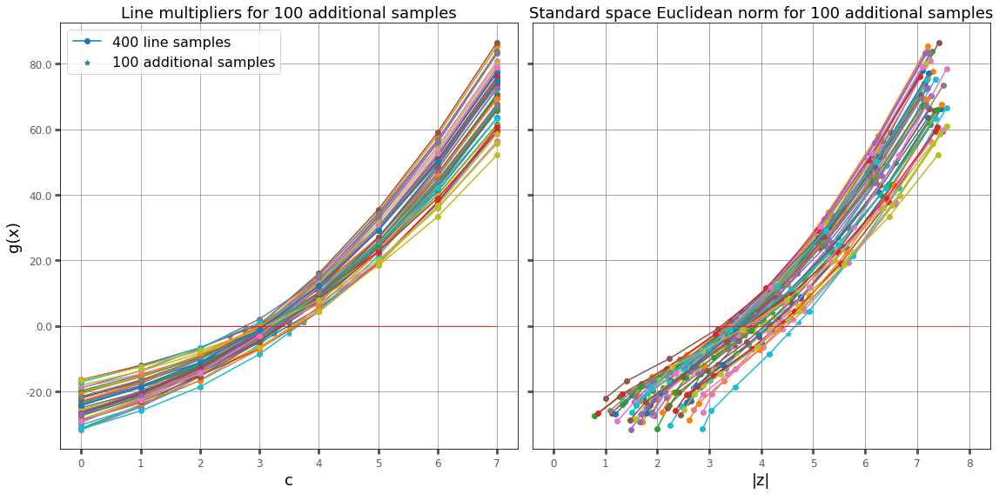
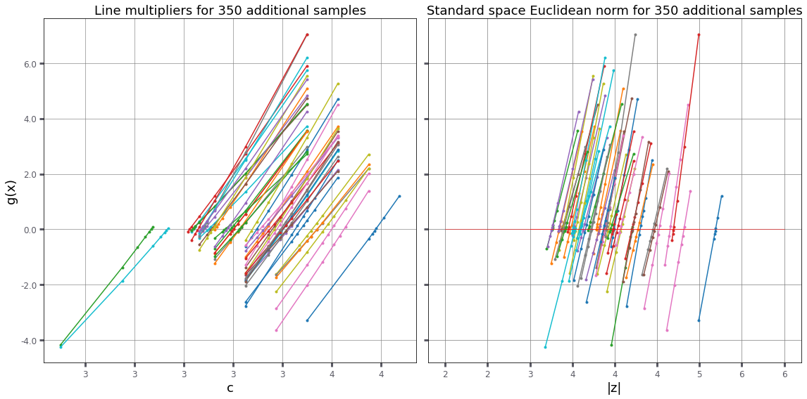

# RP14 problem statement

| `set_id` | `problem_id` |
| -------- | ------------ |
| 1        | 1            |

challenge set_1

## Overview

| Category                                              | Value          |
| ----------------------------------------------------- | ---------------|
| Type                                                  | Symbolic       |
| Number of random variables                            | 5              |
| Failure probability, $P_\mathrm{f}$                   | ~~7.52e-3~~ 5.69e-4|
| Reliability index, $\beta=-\Phi^{-1}(P_\mathrm{f})$   | ~~2.42~~ 3.25  |
| Number of performance functions                       | 1              |
| Continuity                                            | $\geq C^1$     |
| Reference                                             | [Schueller2004]|

## Performance function

$$g({\bf X}) = X_1 - \frac{32}{\pi X_2^3}\ \sqrt{\frac{X_3^2 X_4^2}{16} + X_5^2}$$


## Random variables

The parametrization of distributions follows that of in.

| Variable  | Description | Distribution    | $\theta_1$    | $\theta_2$   | Mean     | Std     |
| --------- | ----------- | ----------------| ------------- | ------------ | -------- | --------| 
| $X_1$     | NA          |  Uniform        | 70.0          | 80.0         | 120.0    | 12.0    |
| $X_2$     | NA          |  Normal         | 39.0          | 0.1          | 120.0    | 12.0    |
| $X_3$     | NA          |  Gumbel-max     | 1342          | 272          | 120.0    | 12.0    |
| $X_4$     | NA          |  Normal         | 400.0         | 0.1          | 120.0    | 12.0    |
| $X_5$     | NA          |  Normal         | 250000.0      | 35000.0      | 50.0    | 10.0    |

The random variables are mutually independent.

<hr>

[Schueller2004] https://rprepo.readthedocs.io/en/latest/references.html#schueller2004


```python
from sampling import linesampling as ls
from sampling import dists as dists
from reliability.tnochallenge import problem
```


```python
RP14 = problem('RP14')
```


```python
C14 = RP14.inputs() # Copula function for the input distributions
```


```python
C14.marginals() # notice the Gumbel-max distribution has rounded values in the table above
```


    (X1 ~ uniform(t1=70, t2=80),
     X2 ~ normal(t1=39, t2=0.1),
     X3 ~ gumbel_max(t1=1342.48, t2=272.894),
     X4 ~ normal(t1=400, t2=0.1),
     X5 ~ normal(t1=250000, t2=35000))


```python
alpha = ls.initialiseAlpha(RP14,C14,gradient=True)
print(alpha)
```

    [-0.5615302239044386, -0.053660476608837736, 0.3804346001443178, 0.0004356175870643556, 0.7328531136198401]


```python
LS = ls.LineSampling(lines=20,alpha=alpha,linegrid=[2,3,4,5,6])
```


```python
cl,cr,data = LS.doLineZero(C14,RP14,additional=3)
print('Euclidean norm of design point: [%g, %g]'%(cl,cr))
```

    Euclidean norm of design point: [3.875, 4]


```python
pF, b, dp, LSdata, LSdata2, cvar, PFLine = LS.failureProbability(C14,RP14,additional=4,seed=7)
print('failure probability:  [%.2e, %.2e]'%(pF[0],pF[1]))
print('reliability index:    [%g, %g]'%(b[0],b[1]))
print('coeff. of variation:  %g'%cvar)
print('total number of runs: %i'%RP14.evaluations())
```

    failure probability:  [4.15e-04, 6.78e-04]
    reliability index:    [3.20402, 3.3427]
    coeff. of variation:  0.643125
    total number of runs: 194


```python
# The coefficient of variation is too high: analysis needs to be done on more lines
```


```python
LS.plotLines3([LSdata,LSdata2])
```





```python
LS.plot(data=LSdata,code=1)
```





```python
LS = ls.LineSampling(lines=200,alpha=alpha,linegrid=[2,3,4,5])
pF, b, dp, LSdata, LSdata2, cvar, PFLine = LS.failureProbability(C14,RP14,additional=4,seed=7)
print('failure probability:  [%.2e, %.2e]'%(pF[0],pF[1]))
print('reliability index:    [%g, %g]'%(b[0],b[1]))
print('coeff. of variation:  %g'%cvar)
print('total number of runs: %i'%RP14.evaluations())
```

    Line 16 is entirely in the safe domain. This line will be discarded
    Line 19 is entirely in the safe domain. This line will be discarded
    Line 38 is entirely in the safe domain. This line will be discarded
    Line 55 is entirely in the safe domain. This line will be discarded
    Line 92 is entirely in the safe domain. This line will be discarded
    Line 150 is entirely in the safe domain. This line will be discarded
    Line 173 is entirely in the safe domain. This line will be discarded
    failure probability:  [3.11e-05, 4.80e-05]
    reliability index:    [3.90033, 4.00422]
    coeff. of variation:  0.638551
    total number of runs: 1766


```python
dp
```


    (3.732133634111079,
     array([-0.16228699,  0.00175321,  0.68722776,  0.44955937,  0.54705963]))


```python
# It looks like there is a better important direction as the norm of the design point is now 3.732133634111079
# which is clearly smaller than the Euclidean norm found on line zero, which lower bound is 3.875
newalpha = dp[1]
```


```python
LS = ls.LineSampling(lines=200,alpha=newalpha,linegrid=[2,3,4,5,6,7])
pF, b, dp, LSdata, LSdata2, cvar, PFLine = LS.failureProbability(C14,RP14,additional=4,seed=7)
```


```python
print('failure probability:  [%.2e, %.2e]'%(pF[0],pF[1]))
print('reliability index:    [%g, %g]'%(b[0],b[1]))
print('coeff. of variation:  %g'%cvar)
print('total number of runs: %i'%RP14.evaluations())
```

    failure probability:  [7.12e-04, 1.06e-03]
    reliability index:    [3.07314, 3.1897]
    coeff. of variation:  0.197513
    total number of runs: 3766


```python
cl,cr,data = LS.doLineZero(C14,RP14,additional=3)
print('Euclidean norm of design point: [%g, %g]'%(cl,cr))
```

    Euclidean norm of design point: [3.375, 3.75]


```python
# Let's see if a better important direction was found:
dp
```


    (3.251553876529722,
     array([-0.18819694,  0.08498914,  0.90628667,  0.07330262,  0.36142766]))


```python
# Because the norm of the design point is 3.25155387653 which is smaller than [3.375, 3.75] found on line zero,
# we conclude that there is better important direction, which alpha is
newalpha = dp[1]
```


```python
LS = ls.LineSampling(lines=200,alpha=newalpha,linegrid=[2,3,4,5,6,7])
pF, b, dp, LSdata, LSdata2, cvar, PFLine = LS.failureProbability(C14,RP14,additional=4,seed=7)
print('failure probability:  [%.2e, %.2e]'%(pF[0],pF[1]))
print('reliability index:    [%g, %g]'%(b[0],b[1]))
print('coeff. of variation:  %g'%cvar)
print('total number of runs: %i'%RP14.evaluations())
```

    failure probability:  [7.02e-04, 9.90e-04]
    reliability index:    [3.0932, 3.1938]
    coeff. of variation:  0.0712736
    total number of runs: 5775


```python
cl,cr,data = LS.doLineZero(C14,RP14,additional=3)
print('Euclidean norm of design point: [%g, %g]'%(cl,cr))
```

    Euclidean norm of design point: [3.125, 3.25]


```python
dp
```


    (3.313841630208539,
     array([-0.36487337,  0.03357331,  0.84283305,  0.07948445,  0.38607633]))


```python
LS = ls.LineSampling(lines=500,alpha=newalpha,linegrid=[1,3,5,6,7])
pF, b, dp, LSdata, LSdata2, cvar, PFLine = LS.failureProbability(C14,RP14,additional=7)
print('failure probability:  [%.2e, %.2e]'%(pF[0],pF[1]))
print('reliability index:    [%g, %g]'%(b[0],b[1]))
print('coeff. of variation:  %g'%cvar)
print('total number of runs: %i'%RP14.evaluations())
```

    failure probability:  [7.25e-04, 7.67e-04]
    reliability index:    [3.16832, 3.18461]
    coeff. of variation:  0.0390972
    total number of runs: 42363


```python
dp
```


    (3.313841630208539,
     array([-0.36487337,  0.03357331,  0.84283305,  0.07948445,  0.38607633]))


```python
LS = ls.LineSampling(lines=50,alpha=newalpha,linegrid=[0,1,2,3,4,5,6,7])
pF, b, dp, LSdata, LSdata2, cvar, PFLine = LS.failureProbability(C14,RP14,additional=2)
print('failure probability:  [%.2e, %.2e]'%(pF[0],pF[1]))
print('reliability index:    [%g, %g]'%(b[0],b[1]))
print('coeff. of variation:  %g'%cvar)
print('total number of runs: %i'%RP14.evaluations())
```

    failure probability:  [3.41e-04, 1.11e-03]
    reliability index:    [3.05884, 3.39638]
    coeff. of variation:  0.110849
    total number of runs: 6284


```python
LS.plot(data=LSdata,code=1)
```


```python
LS.plot(data=LSdata,code=2)
```





```python
LS.plotLines3([LSdata,LSdata2])
```





```python

```

# The reference solution for this problem can be calculated with Monte Carlo
Because of the relatively high value of the target failure probability


```python
N = 10_000_000
x,z,u = C14.sample(N=N) # shape of x: (6, N), void produces N=100 samples  
```


```python
g14 = RP14.g()(*x)
```


```python
i=0
for gi in g14:
    if gi>1:
        i+=1
```


```python
print('%e'%(i/N))
```

    5.692000e-04


```python
sn = dists.normal(0,1,'z')
beta = -sn.ppf(i/N)
print('%g'%beta)
```

    3.25388


```python
LS = ls.LineSampling(lines=50,alpha=newalpha,linegrid=[2,3,4,5])
pF, b, dp, LSdata, LSdata2, cvar, PFLine = LS.failureProbability(C14,RP14,additional=7)
print('failure probability:  [%.2e, %.2e]'%(pF[0],pF[1]))
print('reliability index:    [%g, %g]'%(b[0],b[1]))
print('coeff. of variation:  %g'%cvar)
print('total number of runs: %i'%RP14.evaluations())
```

    failure probability:  [6.20e-04, 6.46e-04]
    reliability index:    [3.21762, 3.22968]
    coeff. of variation:  0.0945446
    total number of runs: 26543863


```python
LS.plotLines2(LSdata2)
```





```python

```
